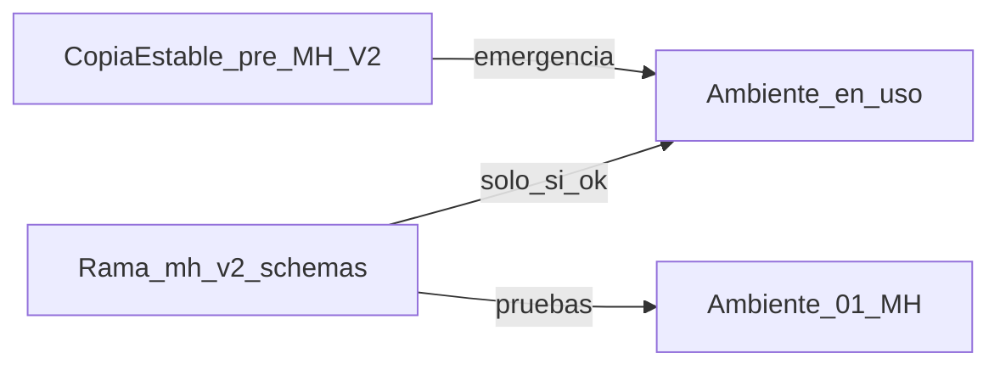

# Plan: MH V2 schemas + copia de emergencia

## Objetivo
Migrar AgilDTE a los JSON Schema nuevos (`svfe-json-schemas`) en **fase de pruebas**, manteniendo una **copia operativa del sistema actual** para volver atrás en minutos si MH o producción fallan mientras sale la versión definitiva.

## Principio de seguridad
No reemplazar `main`/producción a ciegas. Trabajar en paralelo:



---

## Fase A — Copia de emergencia (OBLIGATORIA, antes de tocar builders)

### A1. Congelar código actual
1. Commit o stash limpio de cambios pendientes (PDF comercial / `pdf_tema_color`) en `main` si deben quedar en la copia estable.
2. Crear rama de respaldo **inmutable**:
   - `backup/pre-mh-v2-YYYYMMDD` desde `main` actual
   - Tag git: `pre-mh-v2-stable`
3. Push de rama + tag a `origin` (para recuperar desde cualquier máquina).

### A2. Congelar imágenes Docker actuales
Antes de cualquier rebuild de V2:
```bash
docker tag proyecto-backend:latest proyecto-backend:pre-mh-v2-stable
docker tag proyecto-facturacion_worker:latest proyecto-facturacion_worker:pre-mh-v2-stable
docker tag proyecto-frontend:latest proyecto-frontend:pre-mh-v2-stable
```
(Opcional) `docker save` a un `.tar` en disco externo si quieres backup offline.

### A3. Script de rollback documentado
Un script corto `scripts/rollback-pre-mh-v2.sh` (o `.ps1`) que:
1. Checkout `backup/pre-mh-v2-...` o re-taggee imágenes `pre-mh-v2-stable`
2. `docker compose ... up -d` con esas imágenes
3. Verifique health (backend 8000 + una factura PDF/JSON de prueba)

**Criterio de éxito Fase A:** poder volver al JSON **v1/v3 actual** en &lt; 15 minutos sin depender de “acordarse de los cambios”.

---

## Fase B — Rama de trabajo V2 (pruebas, no definitiva)

1. Desde `main` (después de A1): rama `feature/mh-v2-schemas`.
2. Copiar schemas oficiales a:
   - `backend/api/schemas/mh/v2|v3|v4|v1/` (desde `c:\Proyecto1 (2)5\svfe-json-schemas\svfe-json-schemas`)
3. Variable de entorno / setting:
   - `MH_DTE_SCHEMA_GEN=legacy` | `v2`  
   - Default en pruebas: `v2`  
   - Default en la copia estable / emergencia: `legacy` (builders actuales)

Esto permite **un solo código** con interruptor, o dos despliegues separados (recomendado al inicio: dos despliegues = más seguro).

**Recomendación para tu caso:**  
- **Despliegue estable** = imágenes `pre-mh-v2-stable` (sin código V2).  
- **Despliegue pruebas** = rama `feature/mh-v2-schemas` + ambiente MH `01` (apitest).  
No mezclar clientes reales en V2 hasta sellos verdes.

---

## Fase C — Migración schemas (solo en rama de pruebas)

### C0. Matriz gap
Diff campo a campo (schema nuevo vs builder actual) para: 01, 03, 05, 06, 14, invalidación, contingencia.

### C1. Catálogos
- **CAT-008 Distrito** obligatorio en `direccion` (emisor/receptor).
- Actualizar CAT-013 municipios.
- Modelo + UI (Configuración / Cliente / Facturación) + réplica PosAgil si aplica.

### C2. DTE prioritarios (lo que más emiten)
| Tipo | De → A | Archivos |
|------|--------|----------|
| 01 Factura | v1 → **v2** (`fe-f-v2`) | `dte_01_builder.py`, `version_envio` |
| 03 CCF | v3 → **v4** (`fe-ccf-v4`) | `dte_03_builder.py` |
| 14 FSE | v1 → **v2** (`fe-fse-v2`) | `dte_14_builder.py` |

Cambios típicos ya detectados:
- `direccion.distrito` requerido
- `ivaRete1` → `ivaRete` (Factura/CCF)
- ítems: `noGravado`, `psv`, etc.
- secciones presentes (null ok): `documentoRelacionado`, `otrosDocumentos`, `ventaTercero`, `apendice`
- envelope MH con **versión nueva**

### C3. NC / ND
- 05 → **fe-nc-v4**, 06 → **fe-nd-v4**
- Campo `fusion` en identificación (NC)
- Ajustes de resumen/cuerpo según schema

### C4. Eventos
- Invalidación → **invalidacion-schema-v3** (+ plazos Manual V2.0)
- Contingencia → **contingencia-schema-v4**
- Nuevos (después): Retorno `fe-eret-v1` (18), Op. Especiales `fe-eop-v1` (17)

### C5. PDF legible
Actualizar representación gráfica solo si hay campos nuevos visibles (distrito, etc.), sin romper el diseño comercial.

### C6. Pruebas mínimas MH (ambiente 01)
Por cada tipo migrado: generar → firmar → transmitir → **sello de recepción**.  
Registrar JSON enviado/rechazado para no perder el diff.

---

## Fase D — Entrada a “definitivo” (solo si pruebas OK)

1. Checklist sellos verdes 01/03/14 (+ 05/06 si aplica).
2. Merge `feature/mh-v2-schemas` → `main`.
3. Rebuild imágenes prod + tag `mh-v2-YYYYMMDD`.
4. **Mantener** tag/rama `pre-mh-v2-stable` al menos 30–60 días.
5. Plan de rollback listo el día del corte.

---

## Qué NO hacer al inicio
- No borrar builders legacy hasta tener semanas de sellos estables.
- No apuntar producción (`ambiente 00`) a schemas V2 en el primer sprint de pruebas.
- No depender solo de “tengo el código en la laptop”: la copia debe estar en **git remoto + tags Docker**.

---

## Orden de ejecución concreto (próximos pasos)

1. **Hoy:** Fase A (rama `backup/pre-mh-v2-…` + tags Docker + script rollback).  
2. **Luego:** Fase B (rama `feature/mh-v2-schemas` + copiar schemas al repo).  
3. **Después:** C1 distrito + C2 Factura/CCF/FSE en apitest.  
4. **Después:** C3 NC/ND + C4 invalidación/contingencia.  
5. **Al final:** C eventos nuevos y corte a definitivo (Fase D).

---

## Criterio de “emergencia resuelta”
Si V2 rompe emisión:
1. Ejecutar script rollback → imágenes `pre-mh-v2-stable`.
2. Verificar emisión de un CF/CCF con sello (o al menos JSON legacy aceptado).
3. Seguir depurando V2 solo en la rama/despliegue de pruebas.
